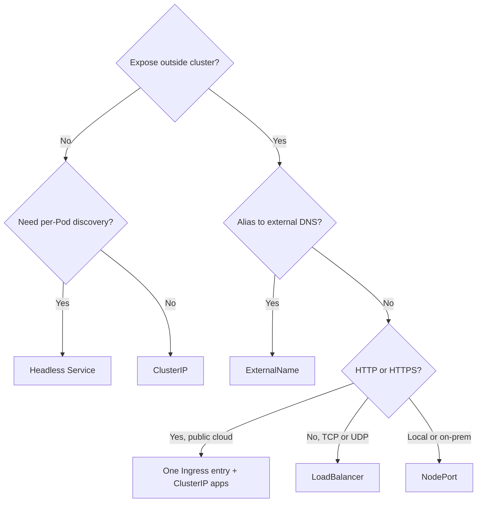

# Session 11 — Kubernetes Services and Workload Identity

**Author:** Kartikey · **Enrollment:** 10121

Run from this directory against a running Minikube cluster. The manifests provide examples for the assignment; commands that alter host DNS or run long-lived tunnels are described but should be run only on the workstation where the cluster is active. Terminal evidence from this run is linked below.

## Four ports

`containerPort` documents the application listener in a Pod; `targetPort` is the destination port on each selected Pod; Service `port` is the virtual Service port; `nodePort` is the node-level port in the reserved range. Traffic path: `client → nodeIP:30080 → serviceIP:8080 → podIP:80`.

## Service labs

| Type | Example | Behavior |
|---|---|---|
| ClusterIP | `01-clusterip/` | In-cluster stable virtual IP and DNS; selector builds endpoints. |
| NodePort | `02-nodeport/` | Opens a node port and forwards to Service endpoints. |
| LoadBalancer | `03-loadbalancer/` | Requests external load balancing; Minikube needs `minikube tunnel` for its local implementation. |
| ExternalName | `04-externalname/` | DNS CNAME alias to an external hostname; no selector, ClusterIP or proxying. |
| Headless | `05-headless/` | `clusterIP: None`; DNS returns ready Pod addresses, useful with StatefulSets. |
| Selectorless | `07-empty-endpoints.yaml` | Service routes only after a matching Endpoints/EndpointSlice is supplied. The example address is documentation-only (`192.0.2.10`). |

### ClusterIP commands

```sh
kubectl apply -f 01-clusterip/app-deployment.yaml -f 01-clusterip/service.yaml -f 01-clusterip/client-pod.yaml
kubectl rollout status deployment/web-app-clusterip
kubectl wait --for=condition=Ready pod/curl-client --timeout=120s
kubectl get svc,endpoints web-service-clusterip
kubectl exec curl-client -- wget -qO- http://web-service-clusterip:8080/ | grep -i title
kubectl exec curl-client -- wget -qO- http://web-service-clusterip.default.svc.cluster.local:8080/ | grep -i title
kubectl exec curl-client -- cat /etc/resolv.conf
kubectl delete -f 01-clusterip/client-pod.yaml -f 01-clusterip/service.yaml -f 01-clusterip/app-deployment.yaml
```

### NodePort, LoadBalancer and DNS

```sh
kubectl apply -f 02-nodeport/app-deployment.yaml -f 02-nodeport/service.yaml
kubectl get svc web-service-nodeport
minikube service web-service-nodeport --url
kubectl apply -f 03-loadbalancer/app-deployment.yaml -f 03-loadbalancer/service.yaml
kubectl get svc web-service-loadbalancer
# In another terminal: minikube tunnel
kubectl get svc web-service-loadbalancer
kubectl apply -f 04-externalname/service.yaml -f 04-externalname/client-pod.yaml
kubectl wait --for=condition=Ready pod/dns-test-client --timeout=120s
kubectl exec dns-test-client -- nslookup external-database-service.default.svc.cluster.local.
```

Minikube's Docker driver runs the node in a container network. On macOS/Windows, its internal node IP may not be directly routable from the host. `minikube service <name> --url` creates a local forwarding URL; `minikube tunnel` supplies routes/load-balancer integration. Do not claim direct NodePort access worked unless it was tested on this host.

### Headless DNS and identity

```sh
kubectl apply -f 05-headless/service.yaml -f 05-headless/app-statefulset.yaml -f 05-headless/client-pod.yaml
kubectl rollout status statefulset/web-stateful --timeout=180s
kubectl exec headless-dns-client -- nslookup web-service-headless
kubectl exec headless-dns-client -- nslookup web-stateful-0.web-service-headless.default.svc.cluster.local
kubectl delete -f 05-headless/client-pod.yaml -f 05-headless/app-statefulset.yaml -f 05-headless/service.yaml
```

A Deployment replaces a deleted Pod with a new generated name; a StatefulSet recreates the deleted ordinal with the same stable identity. The StatefulSet sample in `09-identity/` can be used alongside the stateless Deployment.

## Architecture and cost notes

FQDN format is `<service>.<namespace>.svc.<cluster-domain>` (often `cluster.local`). Pod resolver search domains expand short names; `ndots:5` tries search suffixes before an absolute lookup when a query has fewer than five dots, which can add DNS requests for external names. Check the actual Pod's `/etc/resolv.conf` rather than assuming cluster values.

Deployment Pods are interchangeable and scale freely. StatefulSet Pods have stable ordinals, ordered lifecycle, and optional per-ordinal PVCs via `volumeClaimTemplates`; a headless Service supplies stable DNS. DaemonSets place a Pod on each eligible node, commonly for node agents.

For HTTP/HTTPS in cloud clusters, a single Ingress controller and cloud entry load balancer can route many internal ClusterIP services by host/path. A separate `LoadBalancer` Service per application can create many billable cloud load balancers; actual pricing depends on provider, region and configuration. Use direct LoadBalancer exposure for non-HTTP protocols or when independent network front doors are required.

| Illustrative monthly comparison | 50 separate LoadBalancer Services | One shared Ingress entry |
|---|---:|---:|
| Assumed charge per public LB | $25 | $25 |
| Number of public LBs | 50 | 1 |
| Estimated LB charge | $1,250/month | $25/month |
| Estimated difference |  | $1,225/month saved |

This is the assignment's simplified $25-per-LB example, not a provider quote; data processing, gateways, and regional pricing can change the real bill.

```text
Internet → one cloud LB → Ingress controller → ClusterIP A / ClusterIP B / ClusterIP C
```



## Observed lab results

The ClusterIP Service had three ready endpoints and both the short service name and full FQDN returned `<title>Welcome to nginx!</title>`. The client resolver showed `nameserver 10.96.0.10`, search suffixes for `default.svc.cluster.local`, `svc.cluster.local`, and `cluster.local`, and `options ndots:5`. NodePort mapped `80:30080/TCP`; `minikube service web-service-nodeport --url` returned a local `127.0.0.1` URL, and a request through that URL returned `HTTP/1.1 200 OK`. The LoadBalancer Service remained `<pending>` because starting `minikube tunnel` prompted for sudo credentials in this terminal.

The ExternalName Service displayed `CLUSTER-IP <none>` and `EXTERNAL-IP api.github.com`; CoreDNS returned the CNAME and an address during the lookup. The headless Service returned three Pod A records, and direct access to `web-stateful-0.web-service-headless` returned the Nginx title. Deleting the stateless Deployment Pod resulted in a new generated suffix; deleting `web-stateful-0` recreated the same ordinal. A selectorless Service showed the supplied endpoint `192.0.2.10:3306`; that reserved documentation address proves endpoint association only and is not an active database.

## Screenshot evidence

These screenshots show the listed commands and results from this cluster:

- [01.1-four-ports.png](./screenshots/01.1-four-ports.png), [02.1-clusterip-endpoints.png](./screenshots/02.1-clusterip-endpoints.png), [02.2-clusterip-dns-curl.png](./screenshots/02.2-clusterip-dns-curl.png)
- [03.1-nodeport-mapping.png](./screenshots/03.1-nodeport-mapping.png), [03.2-nodeport-access.png](./screenshots/03.2-nodeport-access.png), [04.1-loadbalancer-ip.png](./screenshots/04.1-loadbalancer-ip.png), [04.2-loadbalancer-page.png](./screenshots/04.2-loadbalancer-page.png)
- [05.1-externalname-cname.png](./screenshots/05.1-externalname-cname.png), [05.2-externalname-curl.png](./screenshots/05.2-externalname-curl.png), [06.1-headless-dns.png](./screenshots/06.1-headless-dns.png), [06.2-stateful-ordinal-curl.png](./screenshots/06.2-stateful-ordinal-curl.png)
- [07.1-empty-endpoints.png](./screenshots/07.1-empty-endpoints.png), [07.2-manual-endpoints.png](./screenshots/07.2-manual-endpoints.png), [08.1-resolv-conf.png](./screenshots/08.1-resolv-conf.png), [08.2-coredns-resolution.png](./screenshots/08.2-coredns-resolution.png)
- [09.1-pod-identities.png](./screenshots/09.1-pod-identities.png), [09.2-identity-recreation.png](./screenshots/09.2-identity-recreation.png), [10.1-controller-matrix.png](./screenshots/10.1-controller-matrix.png), [11.1-service-decision-cost.png](./screenshots/11.1-service-decision-cost.png)
- [12.1-docker-driver-direct-failure.png](./screenshots/12.1-docker-driver-direct-failure.png), [12.2-minikube-service-forward.png](./screenshots/12.2-minikube-service-forward.png)

The LoadBalancer stayed pending without the sudo-backed Minikube tunnel; host DNS was checked with Host headers because `/etc/hosts` was not edited.
