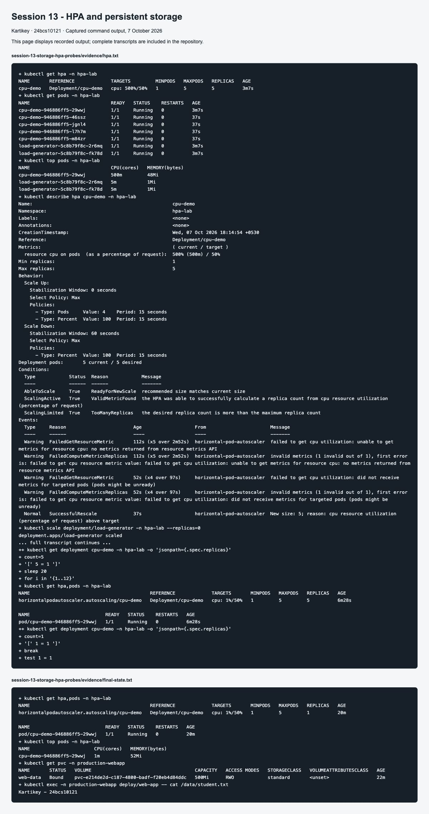

# Session 13: Storage, HPA and probes

**Name:** Kartikey
**Roll number:** 24bcs10121

The mini-project follows the instructor's production-webapp exercise: a 500Mi PVC mounted at `/data`, two Nginx replicas, startup/readiness/liveness probes, and an HPA allowing two to five replicas.

## Tasks and execution

- [Volume concepts and practical examples](01-kubernetes-volumes/README.md)
- [Mini-project implementation and persistence test](mini-project/README.md)
- [Actual storage output](evidence/storage.txt)
- [Actual HPA output, including scale-up and scale-down](evidence/hpa.txt)

Run from this directory with a dedicated Minikube context:

```bash
minikube addons enable metrics-server -p kartikey-devops
kubectl create namespace hpa-lab
kubectl apply -n hpa-lab -f 04-hpa/hpa.yml
kubectl get hpa,pods -n hpa-lab
kubectl apply -n hpa-lab -f 04-hpa/load-generator.yaml
kubectl top pods -n hpa-lab
kubectl describe hpa cpu-demo -n hpa-lab
kubectl get hpa -n hpa-lab --watch
kubectl scale deployment/load-generator -n hpa-lab --replicas=0
```

The CPU demonstration uses the Kubernetes HPA example, which performs CPU work per HTTP request. Ordinary requests to a static Nginx page may not create enough CPU load. CPU requests are `100m`, the target is 50%, and the maximum is five Pods. The recorded run reached 500m/500% on the original Pod and scaled from one to five; after stopping load it returned to one. Metrics were initially unavailable while Metrics Server gathered its first samples. Utilization is usage divided by requested CPU, not by the limit. The scale-down stabilization window is 60 seconds in this lab.

The supplied `01-volumes`, `02-persistent-storage`, `03-storageclass`, and `05-probes` examples are retained for practice. `04-hpa/hpa.yml` is the tested standalone HPA exercise; do not apply every alternative recursively together.

## Cleanup

```bash
kubectl delete namespace hpa-lab production-webapp
```

Deleting the namespace also deletes its PVC; with the Minikube default Delete reclaim policy, its backing data is removed. Preserve required evidence first.

## Screenshot evidence



Command-output screenshots display the captured transcripts; the full text files are retained in `evidence/`. GitHub and application screenshots capture their live pages.

The production-webapp mini-project also completed its own Service HTTP check and 2 → 5 → 2 scaling exercise: [commands and evidence](mini-project/README.md#mini-project-load-and-service-verification).
