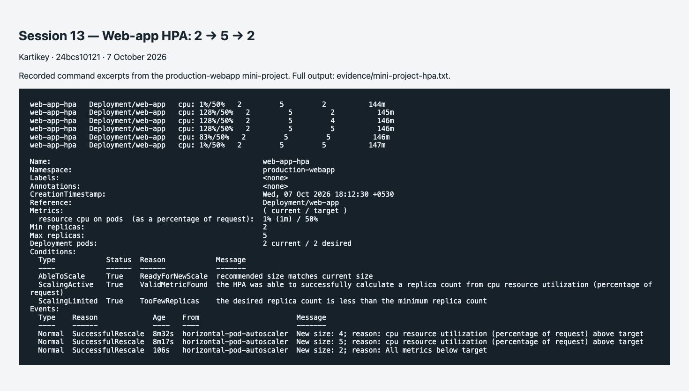

# Production web application mini-project

**Name:** Kartikey
**Roll number:** 24bcs10121

```text
Service web-service -> 2..5 web-app Pods -> /data -> web-data PVC -> Minikube storage
                            |
                    startup / readiness / liveness
                            |
                  Metrics Server -> CPU HPA
```

```bash
kubectl apply -f namespace.yaml
kubectl apply -f pvc.yaml -f deployment.yaml -f service.yaml -f hpa.yaml
kubectl rollout status -n production-webapp deployment/web-app
POD=$(kubectl get pods -n production-webapp -l app=web-app -o jsonpath='{.items[0].metadata.name}')
kubectl exec -n production-webapp "$POD" -- sh -c 'printf "Kartikey - 24bcs10121\n" > /data/student.txt'
kubectl delete pod -n production-webapp "$POD"
kubectl wait -n production-webapp --for=condition=Ready pod -l app=web-app --timeout=180s
NEW_POD=$(kubectl get pods -n production-webapp -l app=web-app --sort-by=.metadata.creationTimestamp -o jsonpath='{.items[-1].metadata.name}')
kubectl exec -n production-webapp "$NEW_POD" -- cat /data/student.txt
kubectl port-forward -n production-webapp svc/web-service 8085:80
```

The replacement Pod read `Kartikey - 24bcs10121` from the same PVC. [Full command transcript](../evidence/storage.txt).

Startup probes allow the process to initialize before other probes run. Readiness failure removes a Pod from ready Service endpoints without restarting it. Liveness failure causes a restart. Changing readiness to an invalid path demonstrates a Running Pod with `0/1` readiness; inspect EndpointSlices, then restore `/`. A wrong liveness path creates repeated restarts and should be corrected rather than increasing thresholds indefinitely.

The PVC deliberately uses the `standard` Minikube StorageClass. The shared RWO volume and Recreate strategy are specific to this single-node lab. The web app was also tested directly with HTTP traffic from two Fortio load-generator Pods. Its HPA scaled from 2 to 4 to 5 replicas at 128% CPU utilization against a 50% target, then returned to 2 after load removal and stabilization. The separate compute-intensive demo remains an additional exercise.

## Mini-project load and Service verification

Run `bash run-hpa.sh` after deploying the mini-project. It verifies HTTP through `web-service`, starts the digest-pinned load generator, captures CPU/Pod/HPA output, removes the generator, and waits for automatic scale-down. An EXIT handler removes the generator if the script fails. The generator is not part of the normal application deployment.

[Full observed output](../evidence/mini-project-hpa.txt)


