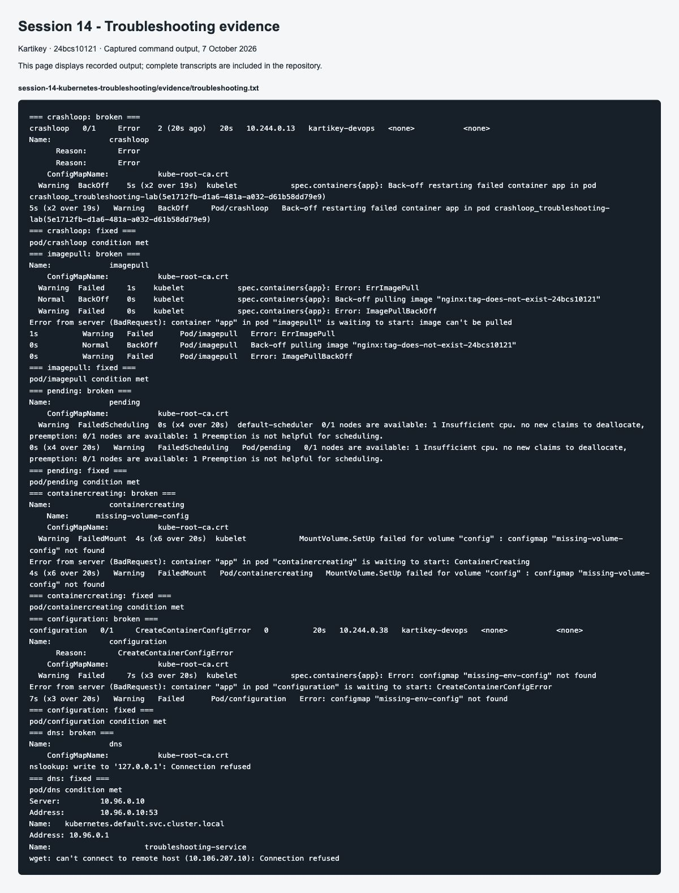

# Session 14: Kubernetes troubleshooting

**Name:** Kartikey
**Roll number:** 24bcs10121

Run `bash run-lab.sh` from this directory. It creates only the `troubleshooting-lab` namespace. The script inspects broken resources before replacing them with the paired fixed manifests. [Full before/after transcript](evidence/troubleshooting.txt).

| Failure | Observation and investigation | Root cause | Fix / verification |
|---|---|---|---|
| CrashLoopBackOff | `get`, `describe`, `logs --previous`, and events show repeated termination. | Startup command exits with code 1. | Correct command; replacement stays Running. |
| ErrImagePull / ImagePullBackOff | Events show failed pull followed by retry backoff. | Nonexistent image tag. These are stages of the same failure. | Use valid Nginx tag; wait for Ready. |
| Pending | Scheduler reports insufficient CPU. | Request is 100 CPU cores on a four-core node. | Remove impossible request; Pod is scheduled. |
| ContainerCreating | `describe` reports FailedMount. | Referenced volume ConfigMap does not exist. | Correct/remove the invalid volume reference; Pod starts. |
| Configuration | `CreateContainerConfigError` in container waiting state. | Missing ConfigMap used by an environment variable. | Correct the configuration reference; verify Ready. |
| DNS | `nslookup` reports connection refused. | Pod points DNS at loopback rather than cluster DNS. | Restore ClusterFirst policy; Service FQDN resolves. |
| Service connectivity | Service exists but EndpointSlice has no matching addresses. | Selector `wrong-app` does not match Pod label. | Restore `app: troubleshooting-app`; HTTP succeeds. |
| Pod networking / port | DNS and endpoint address exist but HTTP to Service fails. | Service forwards to port 81; process listens on port 80. | Verify `curl localhost:80` inside Pod, restore targetPort 80, retest HTTP. |

Service changes take time to reach kube-proxy. The first immediate request after breaking the target port still used the previous route. Waiting for reconciliation exposed the failure; the transcript keeps that observation and the subsequent successful fix.

## Command reference

| Command | What I use it for |
|---|---|
| `kubectl get pods -o wide` | Status, restart count, node and Pod IP. |
| `kubectl describe pod NAME` | Scheduling, image, mounts, probes and events. |
| `kubectl logs NAME --previous` | Output from the last crashed container. Use ordinary `logs` for the current container. |
| `kubectl exec NAME -- COMMAND` | DNS, files and HTTP checks from inside the network namespace. |
| `kubectl events --for pod/NAME` | Recent events for one failing object. |
| `kubectl explain pod.spec.containers` | API fields and accepted structure. |
| `kubectl top pods` | Current CPU and memory samples; requires Metrics Server. |
| `kubectl get endpointslices` | Addresses and ports behind a Service. |

## Mini-project answers

1. `get` provides a concise object summary; it does not identify every root cause.
2. `describe` expands configuration, conditions and recent events for an object.
3. Logs show application output and failures after the container starts.
4. `exec` is useful when a container is running and I need to inspect its environment or connectivity.
5. CrashLoopBackOff means repeated container exits with increasing retry delays.
6. ImagePullBackOff means retries are delayed after an image pull failure; check image name, credentials, registry and network.
7. A Pod can be Pending because of capacity, placement constraints, taints or an unbound claim.
8. A Service can have no ready endpoints because of mismatched selectors or failed readiness probes.
9. A Service's selector must match the Pod's labels; it does not select a Deployment name.
10. Kubernetes DNS resolves Service names such as `troubleshooting-service.troubleshooting-lab.svc.cluster.local` to their cluster addresses.

The supplied `mini-project/broken-pod.yaml` requests an invalid image. Its status is ErrImagePull and then ImagePullBackOff; `describe pod project-broken-pod` reveals the pull error. Replace the invalid tag with a valid Nginx tag. `cases/imagepull-*` provides the executed equivalent with paired broken/fixed versions.

This cluster uses kindnet, so these tests do not claim that NetworkPolicy enforcement was verified. For policy faults, use a policy-capable CNI and inspect ingress/egress rules in both namespaces.

Cleanup: `kubectl delete namespace troubleshooting-lab`.

## Screenshot evidence

Command-output screenshots display the captured transcripts; the full text files are retained in `evidence/`. GitHub and application screenshots capture their live pages.
