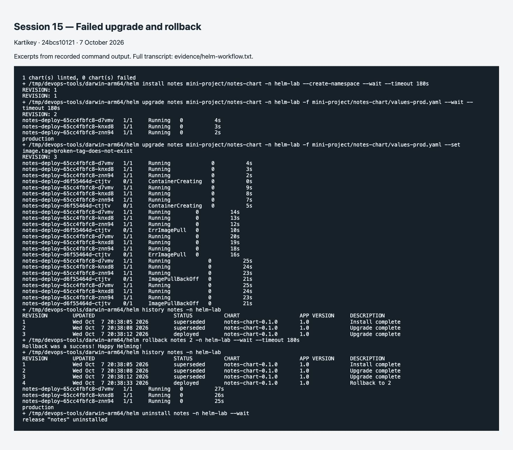

# Session 15: Helm

**Name:** Kartikey
**Roll number:** 24bcs10121

The Notes application follows the instructor's mini-project: an Nginx Deployment, ConfigMap and NodePort Service packaged in a chart. Development uses one replica; production values use three. A ConfigMap checksum in the Pod template makes an environment change restart the Pods instead of leaving stale environment variables.

Run `bash run-lab.sh`. [Complete output](evidence/helm-workflow.txt) includes every command below and the observed release revisions.

| Command | Purpose |
|---|---|
| `helm create practice` | Scaffold a chart. The script uses a temporary directory. |
| `helm repo add bitnami https://charts.bitnami.com/bitnami` | Register a chart repository. |
| `helm repo update` | Refresh chart index. |
| `helm search repo bitnami/nginx` | Find repository charts and versions. |
| `helm lint mini-project/notes-chart` | Check chart structure and rendering. |
| `helm template notes mini-project/notes-chart` | Inspect rendered Kubernetes resources without installing. |
| `helm install notes mini-project/notes-chart -n helm-lab --create-namespace --wait` | Create revision 1. |
| `helm list -n helm-lab` | List installed releases. |
| `helm status notes -n helm-lab` | Inspect release status. |
| `helm get values notes -n helm-lab` | Show overrides used for release. |
| `helm get manifest notes -n helm-lab` | Show installed manifests. |
| `helm upgrade notes mini-project/notes-chart -n helm-lab -f mini-project/notes-chart/values-prod.yaml --wait` | Revision 2: three replicas and production settings. |
| `helm upgrade ... --set image.tag=broken-tag-does-not-exist` | Revision 3: intentionally broken image; observe ErrImagePull and ImagePullBackOff. |
| `helm history notes -n helm-lab` | Inspect revisions and statuses. |
| `helm rollback notes 2 -n helm-lab --wait` | Revision 4 restores the working production revision. |
| `helm uninstall notes -n helm-lab --wait` | Remove release resources. |

The run verified Pods and `printenv ENVIRONMENT` after changes. The bad upgrade produced `ImagePullBackOff`. Rollback restored three healthy replicas and the `production` environment value. A rollback creates a new revision; it does not erase historical revisions. Helm rollback also does not undo database schema/data changes, which need a separate migration policy.

Use a distinct `service.nodePort` override when installing another Notes release in the same cluster, because a NodePort is cluster-wide.

## Screenshot evidence

Command-output screenshots display the captured transcripts; the full text files are retained in `evidence/`. GitHub and application screenshots capture their live pages.
