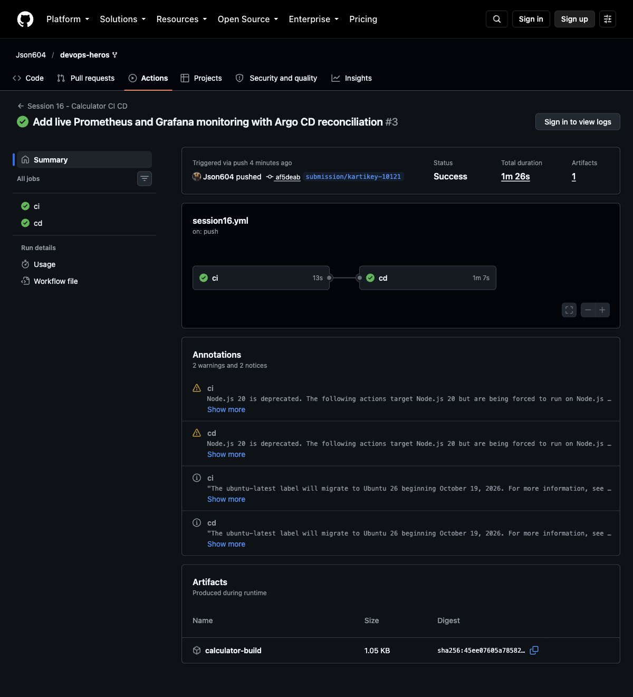

# Session 16: CI/CD with GitHub Actions

**Name:** Kartikey
**Roll number:** 24bcs10121

The `10-final-cicd-pipeline` calculator implements addition, subtraction, multiplication and division, including zero-division validation. It adds a small HTTP interface so the CD stage can deploy and verify an actual service.

```bash
cd 10-final-cicd-pipeline
python -m venv .venv
.venv/bin/python -m pip install -r requirements.txt
.venv/bin/python -m pytest -v
bash build.sh
docker build -t calculator:local .
docker run --rm -p 8088:8080 calculator:local
curl 'http://localhost:8088/calculate?operation=add&a=10&b=5'
```

The [active workflow](../.github/workflows/session16.yml) runs at the repository root. The nested copy is supplied with the demo; GitHub does not automatically discover nested workflows.

## Pipeline concepts

CI checks whether a change builds and passes tests. Continuous delivery produces a releasable artifact; continuous deployment also applies it to an environment. This workflow uses a `ci` job for tests and a build archive, followed by a `cd` job that builds a non-root Docker image, publishes a commit-SHA tag to GHCR, creates a disposable Kind cluster, deploys two replicas, and checks `10 + 5 = 15` through a Service.

A workflow is the YAML automation definition. Jobs run on Ubuntu runners; steps run shell commands or reusable actions. `needs: ci` prevents deployment after a test failure. The built archive is uploaded as an Actions artifact; it is distinct from the container image in GHCR. `GITHUB_TOKEN` is provided by GitHub and receives `packages: write` only in the publishing job. It is never stored in source code.

Push and pull-request triggers run automatically; fork PRs do not push images. The workflow also supports manual dispatch. The local test transcript is in [evidence/unit-tests.txt](evidence/unit-tests.txt). Hosted run evidence is added after execution.

## Screenshot evidence



Command-output screenshots display the captured transcripts; the full text files are retained in `evidence/`. GitHub and application screenshots capture their live pages.

Successful hosted run: [GitHub Actions — CI and CD passed](https://github.com/Json604/devops-heros/actions/runs/37628858550). The [full hosted log](evidence/github-actions.txt) includes image publication and Kubernetes HTTP verification.
