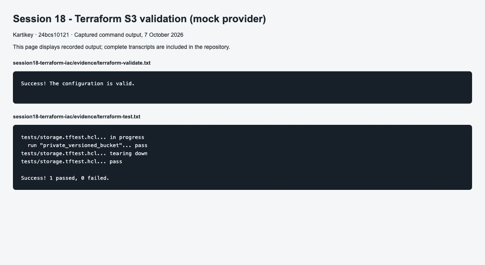
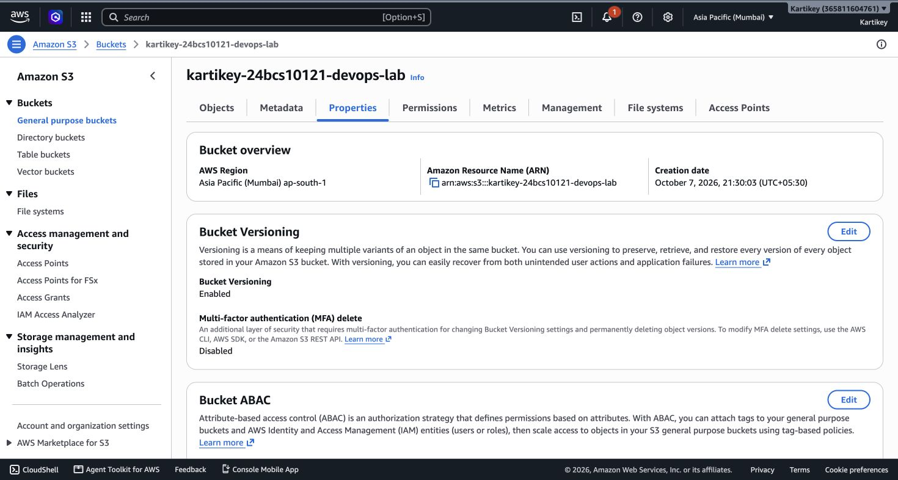
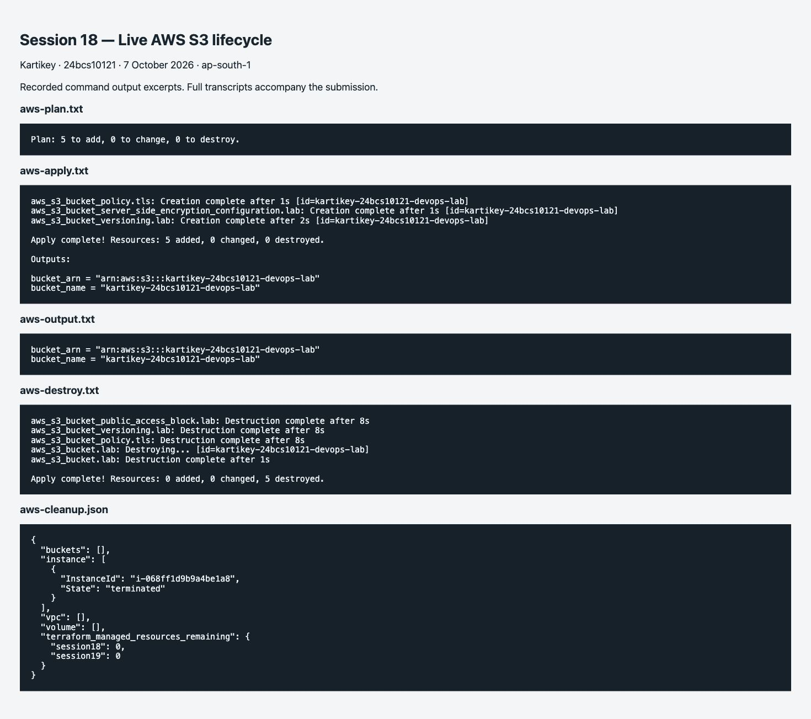

# Session 18: Terraform and AWS services

**Name:** Kartikey
**Roll number:** 24bcs10121

- [Terraform S3 demo](terraform-s3-demo/README.md)
- [IAM](aws-services/01-iam/README.md)
- [EC2](aws-services/02-ec2/README.md)
- [S3](aws-services/03-s3/README.md)
- [VPC](aws-services/04-vpc/README.md)
- [DynamoDB and RDS](aws-services/05-dynamodb-rds/README.md)

Completed the live AWS workflow in Mumbai (`ap-south-1`) on 7 October 2026. Terraform created the private, encrypted, versioned S3 bucket and its four controls (5 resources), then destroyed all five after verification. The bucket is confirmed absent and Terraform state is empty. Local checks and mock tests remain supplementary evidence.

See the [complete S3 execution record](terraform-s3-demo/README.md#live-aws-execution), including plan, apply, show, output, cleanup and AWS Console screenshots.

## Screenshot evidence

Command-output screenshots display the captured transcripts; the full text files are retained in `evidence/`. GitHub and application screenshots capture their live pages.

