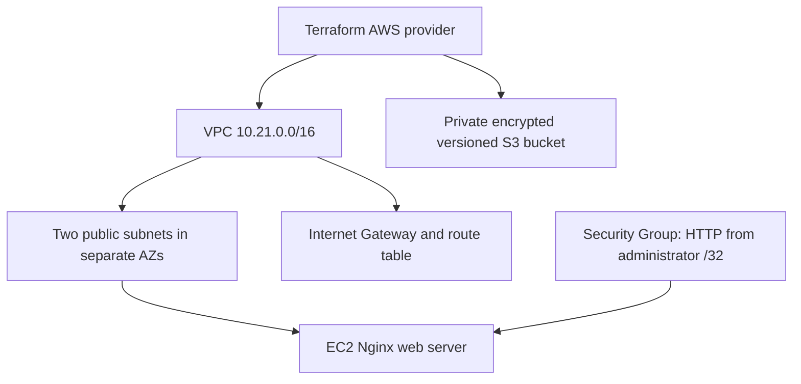
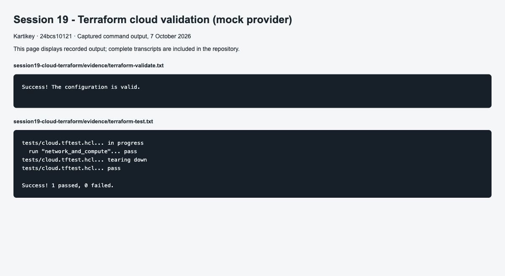
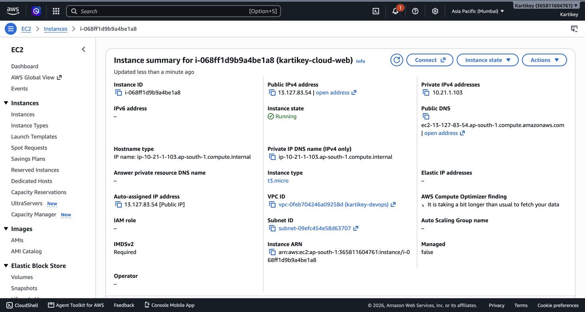
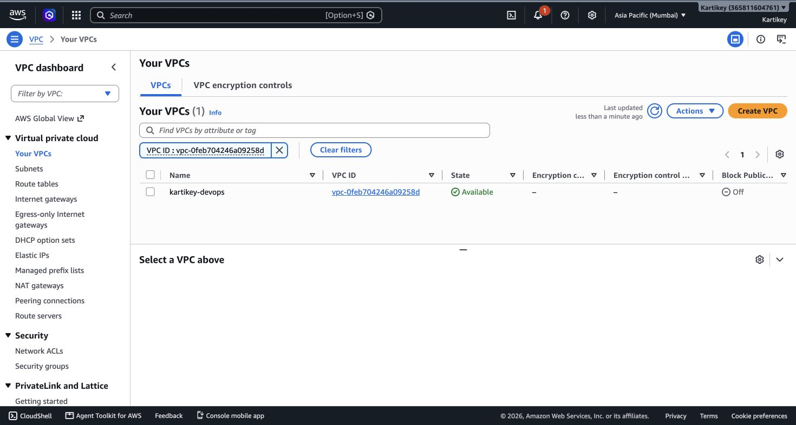
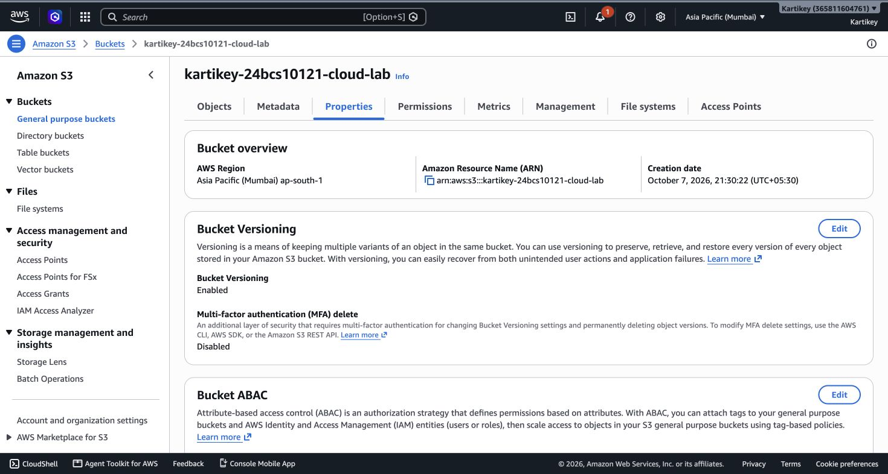
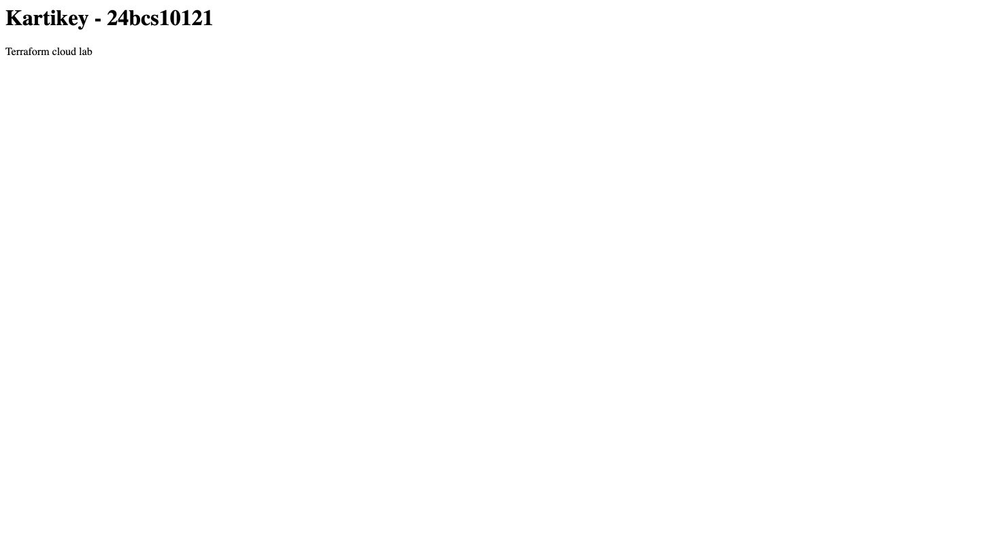
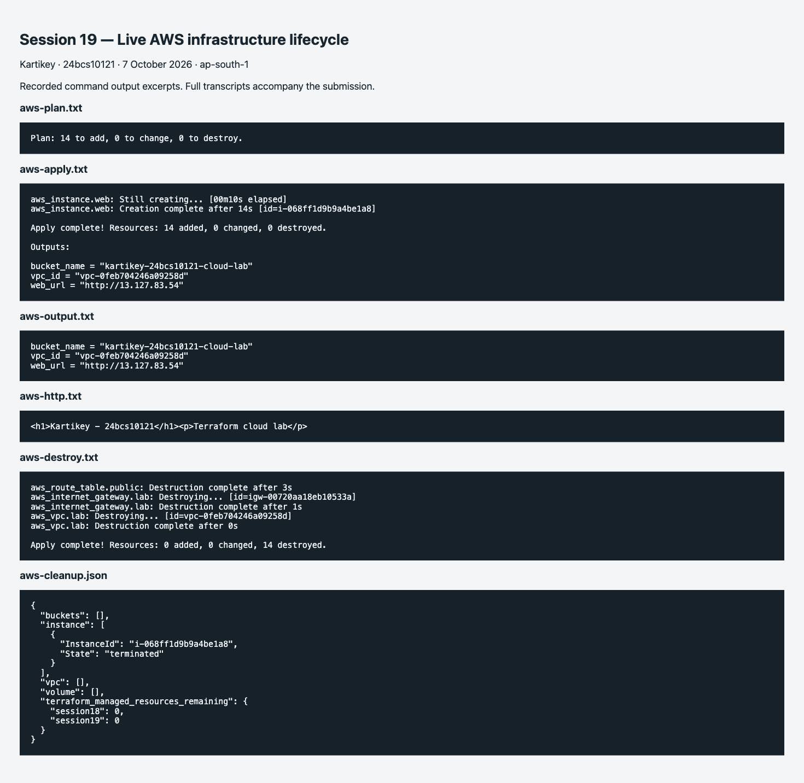
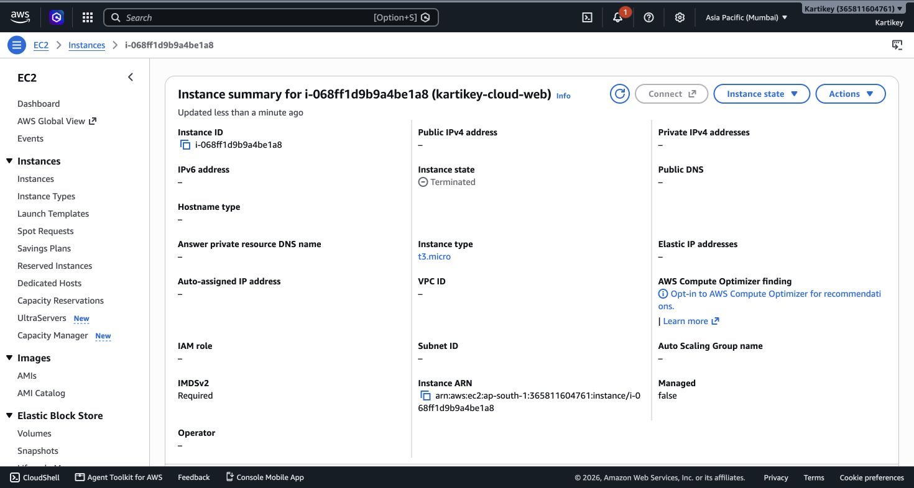

# Session 19: Cloud infrastructure with Terraform

**Name:** Kartikey
**Roll number:** 24bcs10121



The project provisions a VPC, two subnets, an Internet Gateway, a default route, route associations, an HTTP Security Group, an Amazon Linux EC2 instance and an S3 bucket. Terraform references establish dependencies: EC2 needs a subnet/security group and waits for outbound routing before installing Nginx. The provider manages AWS API calls; variables supply region, bucket name, allowed client address and instance size. Outputs expose VPC ID, URL and bucket name.

```bash
cp terraform.tfvars.example terraform.tfvars
# Replace the documentation IP with your current public IPv4 /32.
export AWS_PROFILE=coursework
aws sts get-caller-identity
terraform init
terraform fmt -check
terraform validate
terraform plan -out=cloud.tfplan
terraform apply cloud.tfplan
terraform output
terraform state list
curl "$(terraform output -raw web_url)"
terraform plan -destroy -out=destroy.tfplan
terraform apply destroy.tfplan
```

EC2 user data installs and starts Nginx; wait for initialization before testing. On failure inspect EC2 status, cloud-init logs, route associations and the current allowed client IP. There is deliberately no open SSH rule. State is local for this exercise and must be protected and retained until cleanup. The state and plan files are ignored by Git.

## Validation and execution status

`terraform init`, `validate`, and `terraform test` passed locally. [Mocked architecture test](evidence/terraform-test.txt) checks subnet count and IMDSv2. The mocks produce no AWS resources. The live AWS workflow subsequently completed in Mumbai on 7 October 2026: 14 resources created, EC2 HTTP verified, and all 14 resources destroyed. Post-cleanup AWS checks confirm the instance is terminated, the VPC and root EBS volume are absent, both coursework buckets are absent, and Terraform state contains no managed resources.

The `/32` input is validated to prevent accidentally opening HTTP to the whole internet. The example `203.0.113.10/32` is a documentation address, not a usable deployment setting. Both EC2 and public IPv4 allocation may incur charges; destroy the real stack after its evaluation.

## Screenshot evidence



Command-output screenshots display the captured transcripts; the full text files are retained in `evidence/`. GitHub and application screenshots capture their live pages.

## Live AWS execution record

Terraform provisioned the architecture above using a `t3.micro` EC2 instance. Nginx returned `<h1>Kartikey - 24bcs10121</h1><p>Terraform cloud lab</p>`, verified both by HTTP and in a browser. HTTP was restricted to the administrator's current IPv4 `/32`; that personal address is replaced with `<ADMIN_IPV4>/32` in published text logs. The unredacted local variable file, state and saved plans are excluded from Git.

| Step | Actual result |
|---|---|
| init / fmt / validate | Completed successfully |
| plan | 14 additions; no existing infrastructure changed |
| apply | VPC, two subnets, routing, Security Group, EC2 and S3 created |
| application verification | HTTP returned the student page; AWS Console showed Running |
| destruction | Reviewed deletion-only plan applied; 14 resources destroyed |
| cleanup verification | Instance terminated; VPC, root disk and bucket absent; state empty |

The initial EC2 status sample was taken while AWS health checks were still initializing; the application HTTP request had already succeeded. It is retained without claiming that this early sample showed passed instance health checks.

Evidence: [preflight](evidence/aws-preflight.txt), [plan](evidence/aws-plan.txt), [apply](evidence/aws-apply.txt), [show](evidence/aws-show.txt), [outputs](evidence/aws-output.txt), [HTTP response](evidence/aws-http.txt), [initial instance status](evidence/aws-instance-status.json), [destroy plan](evidence/aws-destroy-plan.txt), [destruction](evidence/aws-destroy.txt), [cleanup verification](evidence/aws-cleanup.json).













The screenshots preserve the live creation/verification stages. The temporary web address is no longer expected to respond after cleanup.
