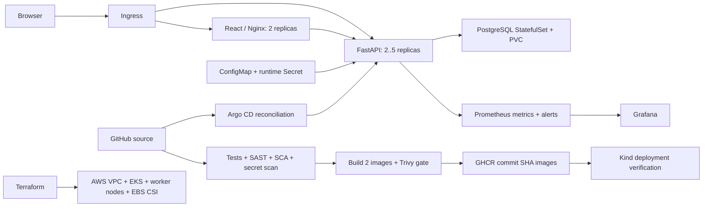

# Campus Helpdesk: final DevOps project

**Name:** Kartikey
**Roll number:** 24bcs10121

Campus Helpdesk tracks campus IT requests by category, requester, priority, assignee and status. It implements a responsive React interface, FastAPI REST endpoints, PostgreSQL persistence, Alembic migrations and a complete build/deploy/observe workflow.

## Architecture



The hosted CI deployment uses a disposable Kind cluster. The persistent local demonstration runs on Minikube. Terraform is ready for a separately authorized AWS deployment; no cloud resources were created in this run.

## Technologies and structure

| Folder | Contents |
|---|---|
| `application/backend` | FastAPI, SQLAlchemy, Pydantic, Alembic, API tests and backend Dockerfile |
| `application/frontend` | React/Vite UI, package lock, multi-stage non-root Nginx image |
| `docker` | Container build/run reference |
| `kubernetes` | Namespace, rendered workload manifests and AWS StorageClass |
| `helm/helpdesk` | Deployment/Service/ConfigMap/Job/StatefulSet/PVC/Ingress/HPA templates |
| `terraform` | AWS network, EKS, node roles, EBS CSI and provider-mocked tests |
| `.github/workflows` | Copy of the active repository-root workflow |
| `security` | Bandit, Gitleaks and Trivy configuration and scan guidance |
| `monitoring` | Prometheus, alert rules, Grafana provisioning and dashboard |
| `gitops` | Argo CD Application and release promotion instructions |
| `troubleshooting` | Reproducible break/investigate/fix script |
| `evidence`, `screenshots` | Actual outputs and captured UI evidence |

## Application and Docker setup

From this directory:

```bash
cp .env.example .env
# Replace POSTGRES_PASSWORD with a random password; keep .env untracked.
# Set FRONTEND_PORT=3100 if 3000 is occupied.
docker compose up -d --build
docker compose ps
curl http://localhost:8000/health
curl http://localhost:8000/ready
```

Open `http://localhost:3000` (or the configured frontend port). The recorded local run uses **3100** because another application owns port 3000. The database first passes its health check, then the one-shot migration service applies the schema, then the backend becomes ready, then the frontend starts. Both application containers run as non-root users. Only loopback ports are published; PostgreSQL is internal to Compose.

For Python development:

```bash
cd application/backend
python -m venv .venv
.venv/bin/python -m pip install -r requirements-dev.txt
.venv/bin/python -m pytest -v
# Configure POSTGRES_* or DATABASE_URL in an untracked .env before these:
.venv/bin/python -m alembic upgrade head
.venv/bin/python -m uvicorn app.main:app --reload --port 8000
```

Run `npm ci && npm run dev` in `application/frontend`; Vite proxies `/api` to port 8000. Build with `npm run build`.

## REST API and tests

| Method / path | Purpose |
|---|---|
| `GET /health` | Process health |
| `GET /ready` | Database/table availability |
| `GET /metrics` | Prometheus metrics |
| `GET /api/tickets` | List tickets |
| `GET /api/tickets/stats` | Counts by status |
| `GET /api/tickets/{id}` | Read a ticket |
| `POST /api/tickets` | Create a request |
| `PUT /api/tickets/{id}` | Update supplied fields |
| `DELETE /api/tickets/{id}` | Delete a request |

API docs are at `/docs` on port 8000. Validation rejects blank titles, invalid status/category/priority, overlong fields and explicit null updates. Missing IDs return 404; deletion returns 204. Seventeen tests use a fresh in-memory SQLite database per test and dependency overrides, so tests do not touch the demonstration database. Compose and Kubernetes smoke checks separately exercise PostgreSQL and the real migration.

## Kubernetes and Helm

```bash
minikube start -p kartikey-devops --driver=docker --cpus=4 --memory=6144 --addons=metrics-server,ingress
docker build -t campus-helpdesk-backend:local application/backend
docker build -t campus-helpdesk-frontend:local application/frontend
minikube -p kartikey-devops image load campus-helpdesk-backend:local campus-helpdesk-frontend:local
bash scripts/create-secret.sh helpdesk
helm lint helm/helpdesk
helm upgrade --install helpdesk helm/helpdesk -n helpdesk --wait --wait-for-jobs --timeout 300s
kubectl get pods,svc,hpa,pvc,ingress -n helpdesk
kubectl port-forward -n ingress-nginx svc/ingress-nginx-controller 8180:80
curl -H 'Host: helpdesk.local' http://localhost:8180/api/tickets
```

For a browser without a hosts-file edit, use `kubectl port-forward -n helpdesk svc/frontend 3101:8080` and open `http://localhost:3101`. This tests the frontend proxy; the Host-header request above separately verifies Ingress routing. The Service names `backend` and `postgres` are stable within a namespace; install one release per namespace.

The ConfigMap supplies non-secret settings. `create-secret.sh` generates a password into a temporary file and creates the Kubernetes Secret without printing it; it preserves an existing Secret on reruns. PostgreSQL has a single persistent StatefulSet replica. The normal migration Job runs once per Helm revision; API readiness waits until the table exists. Startup/liveness check process health, while readiness checks the database. HPA manages backend replica count and requires Metrics Server plus CPU requests.

`kubernetes/resources.yaml` is a rendered alternative for direct `kubectl apply -n helpdesk -f kubernetes/resources.yaml`. Create the Secret first. Do not mix direct apply, Helm and Argo ownership for the same resources. The Secret is intentionally generated at runtime rather than embedded in committed YAML.

## Terraform infrastructure

See [terraform/README.md](terraform/README.md). The project creates a VPC, two public subnets, routes, EKS, two worker nodes, IAM roles and EBS CSI using Pod Identity. It includes `terraform.tfvars.example` with no credentials. Format, validation and mocked-provider architecture tests pass. **Real AWS plan/apply/destroy and Console screenshots are still pending.** They require an AWS profile and a spending decision. Mock output is explicitly identified and is not an AWS deployment claim.

## CI/CD and DevSecOps

The active workflow is [`.github/workflows/helpdesk.yml`](../.github/workflows/helpdesk.yml) at repository root. It runs on main/submission pushes, pull requests and manual dispatch. Tests, frontend build, Bandit, pip-audit, npm audit and Gitleaks precede image building. Trivy must pass for both images with no HIGH/CRITICAL findings before publishing GHCR images tagged with the Git SHA. The last job deploys to Kind using Helm and checks backend readiness, frontend HTTP and ticket creation.

Pipeline artifacts include JUnit results, JSON scan reports and release values with immutable image tags. Publishing uses the scoped GitHub token. No kubeconfig, cloud access key or password is checked in. See [security/README.md](security/README.md) for commands and the initial failed security gate.

## Monitoring and GitOps

[Monitoring setup](monitoring/README.md) provisions Prometheus and Grafana, including request, CPU, memory and health panels. Logs are collected with `kubectl logs`. Alerts detect an unavailable application and a sustained 5xx rate. [GitOps setup](gitops/README.md) uses Git as desired state, Argo CD automated sync, pruning and self-healing. A scanned release is promoted by committing its image tags to values; Argo performs deployment after observing that change.

## Troubleshooting

Follow the [failure recovery guide](troubleshooting/README.md) to pause Argo self-healing first, then run `bash troubleshooting/run-challenge.sh` only against the local `helpdesk` namespace. It introduces image, selector and readiness faults, captures diagnostics, restores the original values, and verifies HTTP. [Session 14](../session-14-kubernetes-troubleshooting/README.md) covers all nine required Kubernetes failure categories.

## Evidence and screenshots

- [API tests](evidence/api-tests.txt), [Compose](evidence/compose.txt), [Kubernetes](evidence/kubernetes.txt), [Ingress API](evidence/ingress-api.txt)
- [SAST](evidence/sast.txt), [dependency audit](evidence/dependency-audit.txt), [secret scan](evidence/secret-scan.txt)
- [Terraform validation](evidence/terraform-validate.txt), [mocked Terraform plan assertions](evidence/terraform-test.txt)
- [Application screenshot](screenshots/helpdesk-compose.jpg)

Hosted run URLs, monitoring and troubleshooting captures are indexed in the submission status document at the repository root. AWS Console screenshots and a classroom presentation cannot be substituted by local output.

## Lessons learned and limits

A Running Pod is not necessarily ready to serve traffic. DNS success does not establish Service port correctness. PVC lifetime is independent of Pod lifetime. HPA initially needs usable metrics and takes time to settle. ConfigMap environment changes need a rollout. Database migrations must complete before readiness succeeds. Container scanning can block an otherwise passing build because OS packages also carry vulnerabilities. GitOps corrects manual drift, so deliberate configuration changes belong in Git.

This is a single-tenant classroom application, with no authentication or authorization layer. Keep it on the local lab network; internet production use would require identity, access control, TLS, backups, persistent monitoring storage and an operational recovery plan. SQLite unit tests supplement rather than replace PostgreSQL integration checks. Grafana uses anonymous read-only viewing for the local demo and its Service remains ClusterIP.

## Cleanup

```bash
docker compose down
# Keep the PostgreSQL volume unless its data is no longer needed.
# For the disposable Kubernetes lab after saving evidence:
minikube delete -p kartikey-devops
```

For cloud infrastructure, use the reviewed Terraform destroy plan described in its README. Delete Kubernetes load balancer resources while the cluster is still available, and check retained PVC/EBS volumes.

## Course source

The exercise structure and original TaskBoard backend pattern come from [Nency-Ravaliya/devops-heros](https://github.com/Nency-Ravaliya/devops-heros), retained under the repository's MIT license. The application domain, ticket fields and validation, UI, tests, secret handling, deployment integration, Terraform and GitOps work are adapted for this submission.

Successful hosted run: [GitHub Actions — tests, security gates, GHCR and Kubernetes deployment](https://github.com/Json604/devops-heros/actions/runs/37628858501). Both final images had zero HIGH/CRITICAL findings in that run.
