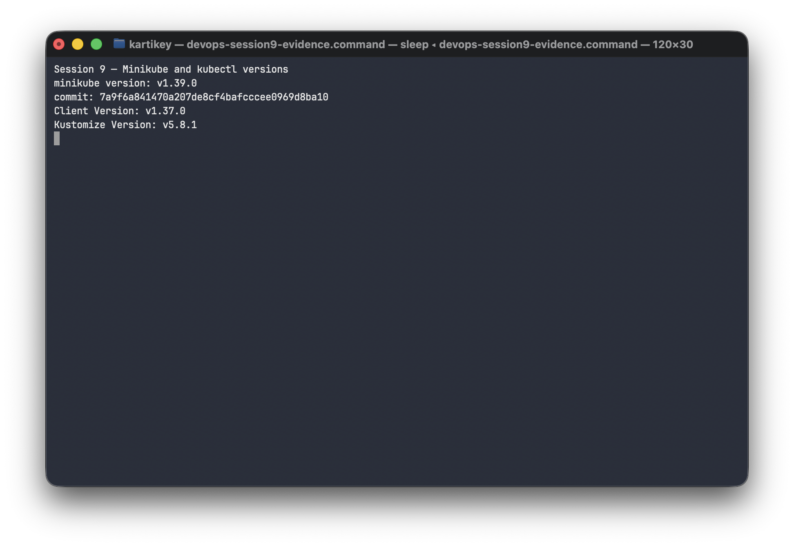
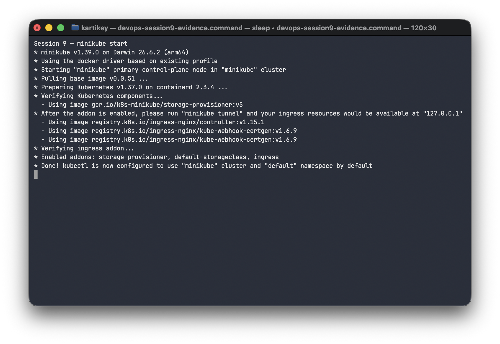
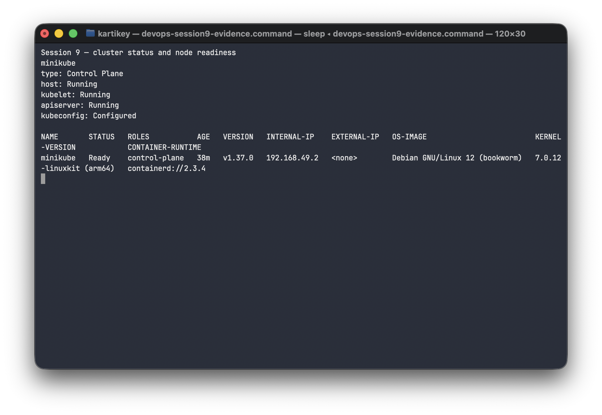
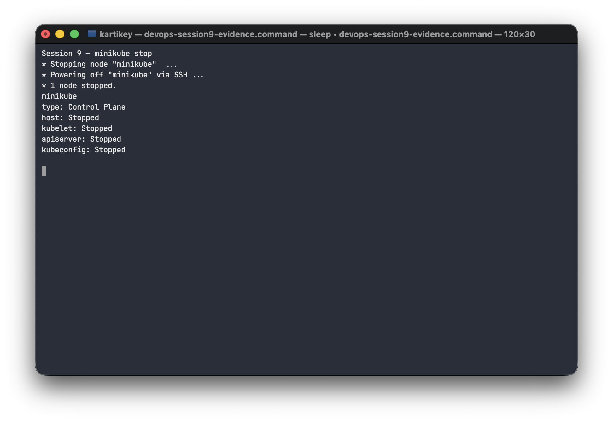

# Session 9: Kubernetes Fundamentals and Cluster Architecture

**Author:** Kartikey · **Course:** SST DevOps & Cloud (SWE) · **Session:** 09

This lab uses Minikube with Docker driver and `kubectl`. Commands below are run from the repository root. The terminal outputs and screenshots below were captured from the local Minikube run.

## 1. Install and verify the tools

**Description:** Install Minikube and the Kubernetes CLI, then check their versions.

```console
$ minikube version
minikube version: v1.39.0
commit: 7a9f6a841470a207de8cf4bafcccee0969d8ba10
$ kubectl version --client
Client Version: v1.37.0
Kustomize Version: v5.8.1
```

**Screenshot:** 

## 2. Start the local cluster

**Description:** Start a single-node Kubernetes cluster with Docker as the driver.

```console
$ minikube start
* minikube v1.39.0 on Darwin 26.6.2 (arm64)
* Using the docker driver based on existing profile
* Starting "minikube" primary control-plane node in "minikube" cluster
* Pulling base image v0.0.51 ...
* Preparing Kubernetes v1.37.0 on containerd 2.3.4 ...
* Verifying Kubernetes components...
  - Using image gcr.io/k8s-minikube/storage-provisioner:v5
  - After the addon is enabled, please run "minikube tunnel" and your ingress resources would be available at "127.0.0.1"
  - Using image registry.k8s.io/ingress-nginx/controller:v1.15.1
  - Using image registry.k8s.io/ingress-nginx/kube-webhook-certgen:v1.6.9
  - Using image registry.k8s.io/ingress-nginx/kube-webhook-certgen:v1.6.9
* Verifying ingress addon...
* Enabled addons: storage-provisioner, default-storageclass, ingress
* Done! kubectl is now configured to use "minikube" cluster and "default" namespace by default
```

**Screenshot:** 

## 3. Check cluster health

**Description:** Confirm the control plane, kubelet, API server and node are ready.

```console
$ minikube status
minikube
type: Control Plane
host: Running
kubelet: Running
apiserver: Running
kubeconfig: Configured
$ kubectl get nodes -o wide
NAME       STATUS   ROLES           AGE     VERSION   INTERNAL-IP    EXTERNAL-IP   OS-IMAGE                         KERNEL-VERSION            CONTAINER-RUNTIME
minikube   Ready    control-plane   38m   v1.37.0   192.168.49.2   <none>        Debian GNU/Linux 12 (bookworm)   7.0.12-linuxkit (arm64)   containerd://2.3.4
```

**Screenshot:** 

## 4. Stop the cluster

**Description:** Stop Minikube cleanly and verify its components are stopped.

```console
$ minikube stop
* Stopping node "minikube"  ...
* Powering off "minikube" via SSH ...
* 1 node stopped.
$ minikube status
minikube
type: Control Plane
host: Stopped
kubelet: Stopped
apiserver: Stopped
kubeconfig: Stopped
```

**Screenshot:** 

## 5. Kubernetes architecture

Kubernetes separates control decisions from the machines that run application Pods. Components communicate through the API server; controllers repeatedly compare observed state with the desired state stored through that API.

```text
 kubectl / controllers
          │ Kubernetes API
          ▼
┌────────────────────── Control plane ───────────────────────┐
│ kube-apiserver ⇄ etcd     scheduler     controller-manager │
└──────────────────────────────┬─────────────────────────────┘
                               │ assigns work / reports state
                 ┌─────────────┴──────────────┐
                 ▼                            ▼
       ┌──── Worker node ────┐       ┌──── Worker node ────┐
       │ kubelet             │       │ kubelet             │
       │ container runtime   │       │ container runtime   │
       │ Pods                │       │ Pods                │
       │ kube-proxy*         │       │ kube-proxy*         │
       └─────────────────────┘       └─────────────────────┘
```

### Control plane

- **kube-apiserver:** Serves the Kubernetes API. `kubectl`, the scheduler, controllers, and node agents use it to read or change cluster objects. It is the front door and authorization point.
- **etcd:** Consistent key-value store for API object data and cluster state. The API server is the supported interface to this data store.
- **kube-scheduler:** Watches for unscheduled Pods, evaluates resource requests and placement constraints, and selects a node. The kubelet on that node then attempts to make the Pod run.
- **kube-controller-manager:** Runs reconciliation loops. Controllers observe API objects and request changes through the API until actual state approaches desired state, for example restoring missing replicas or marking unhealthy nodes.

### Worker node

- **kubelet:** Node agent that watches for Pods assigned to its node, asks the container runtime to run their containers, performs configured health checks, and reports status to the API server.
- **Container runtime:** Pulls images and runs containers through the Container Runtime Interface (CRI), commonly containerd or CRI-O.
- **kube-proxy (where deployed):** Programs node networking rules for Service virtual IP traffic. Some cluster network implementations provide this function without kube-proxy.
- **Pods:** Kubernetes' smallest deployable units. Containers in a Pod share its network identity and can share mounted volumes.

### How they work together

1. A user submits a desired object through `kubectl` to the API server; the API server validates it and persists the object in etcd.
2. The scheduler observes an unscheduled Pod and writes its node assignment through the API server.
3. The selected node's kubelet sees that assignment and asks its runtime to start the Pod's containers.
4. The kubelet reports status back through the API. Controllers continue reconciling, while Service networking sends traffic to ready endpoints.

**Reference:** [Kubernetes cluster architecture](https://kubernetes.io/docs/concepts/architecture/).
